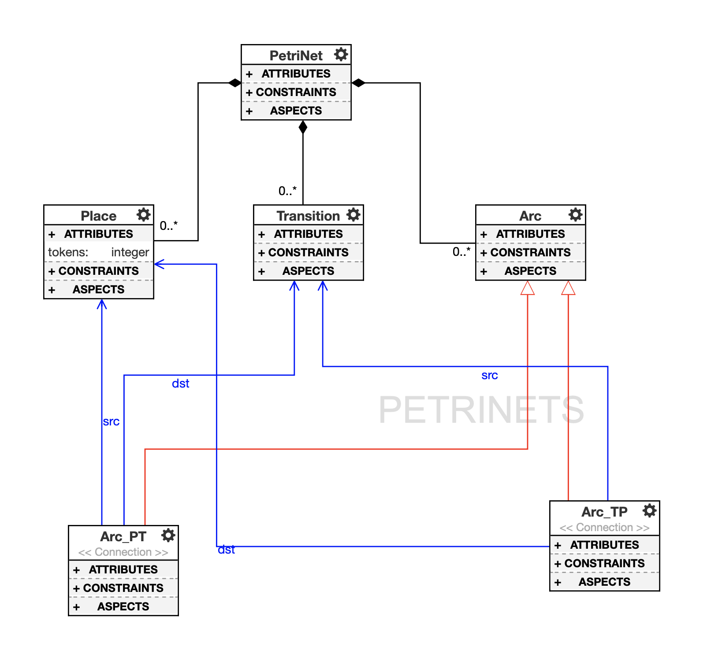
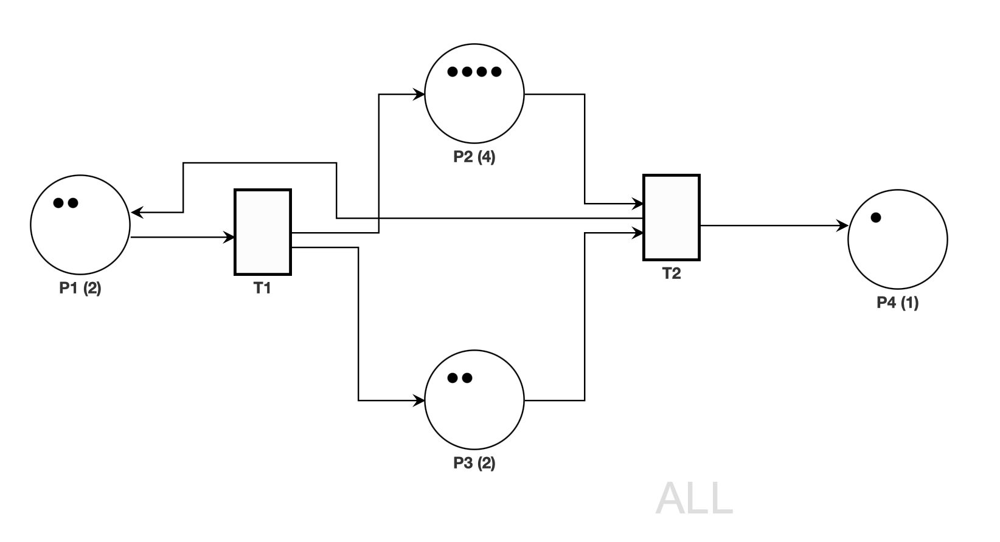
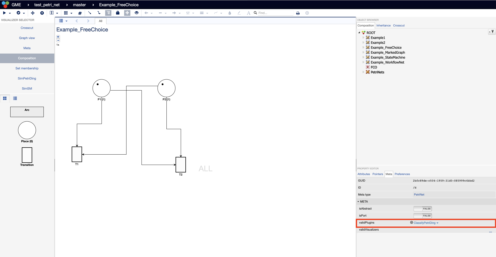
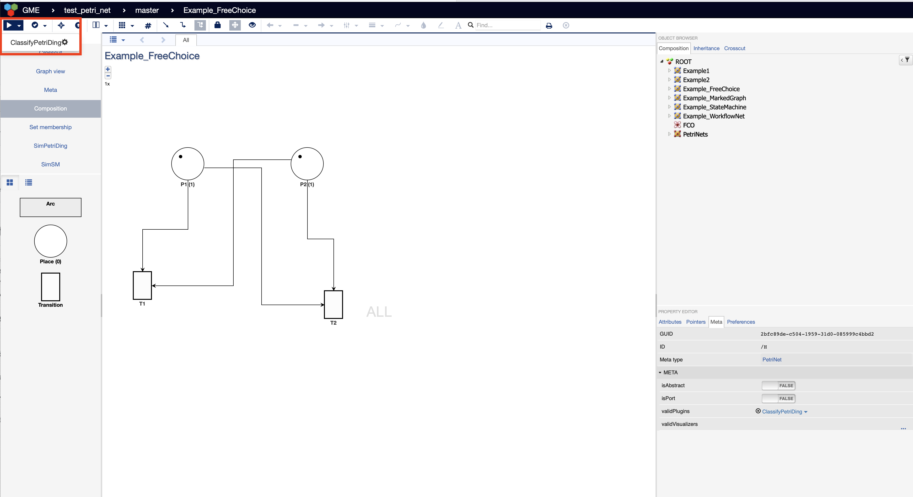
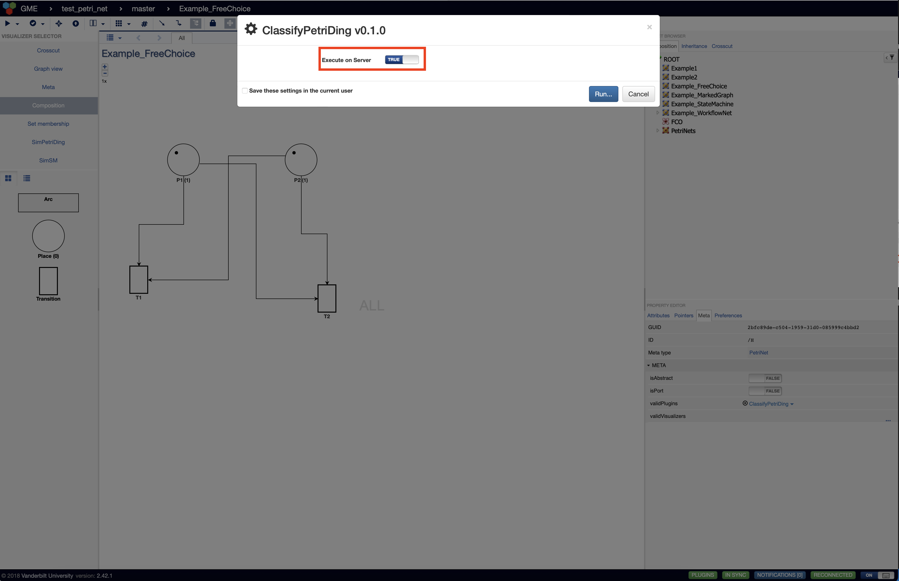
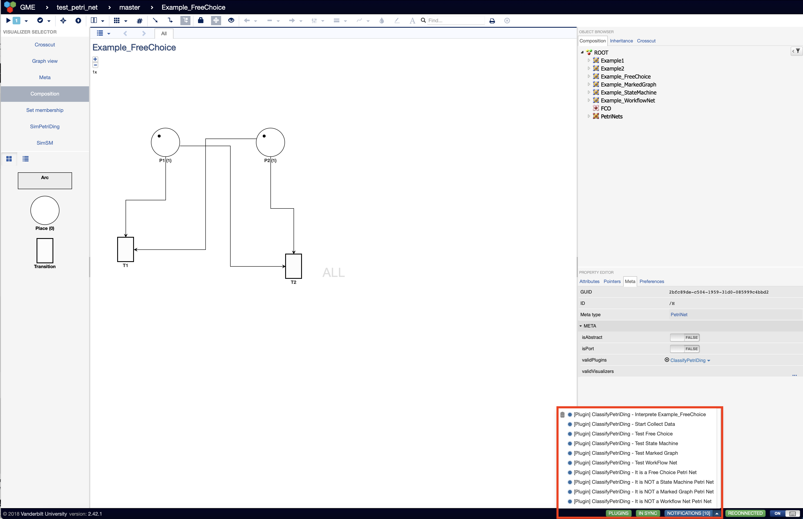

# CS6388 PetriNet Design Studio

## Overview

This is the project for CS6388 Model-Integrated Computing and the goal is to create a design studio that represents the domain of Petri Nets. My project repo is based on the example [StateMachineJoint](https://github.com/kecso/StateMachineJoint) that our instructor Tamas Kecskes created. I initially forked the repo and then modified it to fulfill the specific requirements for this project.

Based on the [project description](ref/Miniproject_MIC_2022Su.pdf), there are four parts to this project and each part will be covered in later sections.
- defining the domain
- creating adequate decoration for the model
- writing the interpretation for the property decisions (classifications)
- creating the simulation visualizer

## Environment Setup

In order to successfully run the WebGME application, we would need to set up a WebGME development environment. The WebGME development environment can be a fully docker based environment or a local environment on the physical machine. In my case, I use the local environment since I encountered some issues installing the `webgme` cli with the docker based environment. Another reason is for easy debugging. With the local environment, edits can be easily tested and represented in the running WebGME application. While with the docker based environment, the image has to be rebuilt in order to get the most recent updates and each build can take up to a few minutes to complete, which greatly slows down the overall processes. There should exist some way to have the docker image use some shared file location which will make the process a lot easier. For those who are interested in running with the  docker based environment, our instructor Tamas Kecskes also created a [WDeStuP](https://github.com/kecso/WDeStuP) repo for this.

The following are the steps that I have taken to install the WebGME development environment on my machine.

### Installing Node.js

I basically followed the steps provided from the official webgme guide on [installing Node.js](https://github.com/webgme/webgme/blob/master/docs/getting_started/dependencies.rst#installing-nodejs). The only difference though is that I installed the v16.16.0 with 
```shell
nvm install v16.16.0
```

### Installing MongoDB

I basically followed the steps provided from the official mongodb guide on [Install MongoDB Community Edition on macOS](https://www.mongodb.com/docs/manual/tutorial/install-mongodb-on-os-x/). The only difference and also an important one is that we cannot install the 6.0 version. Instead we have to install a version before 5.0 , so 4.4 version is installed with 
```shell
brew install mongodb-community@4.4
```

After install mongodb, you need to have mongodb-community@4.4 first in your PATH by running
```shell
echo 'export PATH="/usr/local/opt/mongodb-community@4.4/bin:$PATH"' >> ~/.zshrc
```
Then you need to run mongodb as a backgroud service by running
```shell
brew services start mongodb/brew/mongodb-community@4.4
```

### Installing webgme-cli

I basically followed the steps provided from the official webgme guide on [Installing webgme-cli](https://github.com/webgme/webgme/blob/master/docs/getting_started/creating_a_repository.rst#installing-webgme-cli)

### Start WebGME

After clone the repo, run `webgme start` from the project root to start. Finally, on your browser navigate to `http://localhost:8888` to start WebGME.

## Defining domain
### Basics about PetriNet

A PetriNet consists of four elements: places, transitions, arc (it is also denoted as edges in some literatures and turtorial), and tokens. Graphically, places are represented by circles, transitions by rectangles, edges by directed arrows, and tokens by small solid (filled) circles. In a PetriNet, places cannot be directly connected to other places and transitions cannot be directly connected to other transitions either. Arcs can only connect place to transition or transition to place. 

### Metamodel

The following is the metamodel created in WebGME. Since Arc can connect a place to a transition or a transition to a place, two types are connections are defined to differentiate these two types of Arcs:

* Arc_PT: it is an acr that connects a place to a transition.
* Arc_TP: it is an arc that connects a transition to a place.



## Creating decoration

The following are the list of decorations created in the model editor to resemble the graphical syntax of petri nets:

* Places are circles. 
* The number of tokens with the places are denoted by the name of the places in parenthesis.
* Tokens are highlighted as black dots inside each place.
* Transitions are squares.
* PetriNeta are decorated with a network icon.

The following is an example created using the metamodel and the decorations.



## Adding the Seed

The project is first created in the https://mic.isis.vanderbilt.edu/ and then the master branch is exported locally as `.webgmex` file.

The `.webgmex` file is then added to the existing folder under the `src\seed` folder and is named as `PetriNetDing`. 

Then the `webgme-setup.json` file and the `config\config.webgme.js` file are edited to make the application aware of the new seed being added. For the actual edits made, please refer to the commit comparison.

With all these steps taken, after starting the WebGME and navigating to `http://localhost:8888`, we can create a new project using the `PetriNetDing` seed. 

The following is a video that shows how to create a new project using the newly added `PetriNetDing` seed. After creating a new projet with the seed, you can find the metamodel defination and some examples that I have created using the metamodel for other sections. A HD version of the video can be found [here](https://youtu.be/b19kr4AfcSc)

https://user-images.githubusercontent.com/83924422/184184221-6ec23cf4-d370-4a4a-bf8c-45e20eb158c5.mov

## Writing interpretation

### Different types of PetriNet 

We are going to create an interpeter as a plugin to classifiy if a PetriNet is one of the following types:

*  Free-choice petri net: there are some different criterias that we can use to determine if it is a free choice perti net. It is defining the same target but with different approaches.
    * if the intersection of the inplaces sets of two transitions are not empty,then the two transitions should be the same (or in short, each transition has its own unique set if inplaces)
    * Every arc is either the only arc going from the the place or only arc going to the transition 
    * if there is an arc from a place s to a transition t, then there must be an arc from any input place of t to any output transition of s.
* State machine: a petri net is a state machine if every transition has exactly one inplace and one outplace.
*  Marked graph - a petri net is a marked graph if every place has exactly one out transition 
 and one in transition.
*  Workflow net: a petri net is a workflow net if it has exactly one source place and one sink place. And every path is from the source to the sink.

### Creating Plugins

The first step is to create a plugin named `ClassifyPetriDing` using the WebGME cli as follows:
```shell
webgme new plugin ClassifyPetriDing
```

The application is going to create a folder `ClassifyPetriDing` under the `src\plugins` path. However, the files created are slightly different from the plugin `ReachCheck`, so I copy the files from the `ReachCheck` file into the `ClassifyPetriDing` and make edits on the classnames etc to have it work for my `ClassifyPetriDing` plugin.

### Writing the logic

The core logic of the interpreter is in the `src/plugins/ClassifyPetriDing/ClassifyPetriDing/__init__.py` file. Besides the `main()` function, there are five additional functions created to achieve the classification:
* `collect_data()`: the goal of this function is to go through the current active node and collect all the information under the current active node. The key is to construct a dictionary for places and a dictionary for transitions with information on the src and dst. The data will later be used for the classification.
* `check_free_choice()`: this function implements the logic to classify if the PetriNet is free choice or not. 
* `check_state_machine()`: this function implements the logic to classify if the PetriNet is state machine or not. 
* `check_marked_graph()`: this function implements the logic to classify if the PetriNet is marked graph or not. 
* `check_workflow_net()`: this function implements the logic to classify if the PetriNet is workflow or not. 

Based on the results, the plugin is going to send notification on the classification results.

### Running the plugin

To run the `ClassifyPetriDing` plugin, first we need to add the plugin to the current scope and that can be done by editing `PROPERTY EDITOR` --> `META` --> `validPlugins` as shown below:



After adding the plugin, we can run the plugin by click the start button on the upper left corner of the editor as shown below. 



Remember to choose `Execute on Server` as True to make it run properly, as shown below.



After running the plugin, the testing results will be available in the notification tab on the lower right corner ad shown below. In the example below, I was testing a PetriNet that is a free choice PetriNet but not the other types and the plugin corretly classifies it and sends the correpsonding notification.



### Demo the plugin

The following is a video showing running the `ClassifyPetriDing` plugin with examples of different types of PetriNet and the tesing results. A HD version of the video can be found [here](https://youtu.be/PAEd1SNHpCw).

https://user-images.githubusercontent.com/83924422/184184351-785fa65c-2212-4839-af34-e2dfb59d282a.mov


## Creating simulation

The simulator are expected to implement the following features:
* Should visualize the network similarly to the composition
* Additionally, it should differentiate the transitions that are enabled
* Firing should happen once the user clicks on an enabled transition
* Markings should progress according to firings (no animation is required, but would be
nice)
* The visualizer should have a ‘reset’ button on its toolbar that switches the network back
to the initial marking
* The state of the simulation should not be reflected in the model
* If your network reaches a deadlock (there is no enabled transition), some visual effect
should notify the user (or an actual notification...)

### Creating a visualizer

The first step is to create a visualizer named `SimPetriDing` using the WebGME cli as follows:
```shell
webgme new viz SimPetriDing
```

The application is going to create a folder `SimPetriDing` under the `src\widgets` path and `src\panels` path with all the basic files created.

### Editing the visualization (unable to complete)

To create the simulation visualization as that with the StateMachineJoint, the key is to edit `src/visualizers/panels/SimPetriDing/SimPetriDingControl.js` and `src/visualizers/widgets/SimPetriDing/SimPetriDingWidget.js`. Due to my lack of experience in javascripts and overall time constraints, I was unable to complete this part after several failed attempts. 
